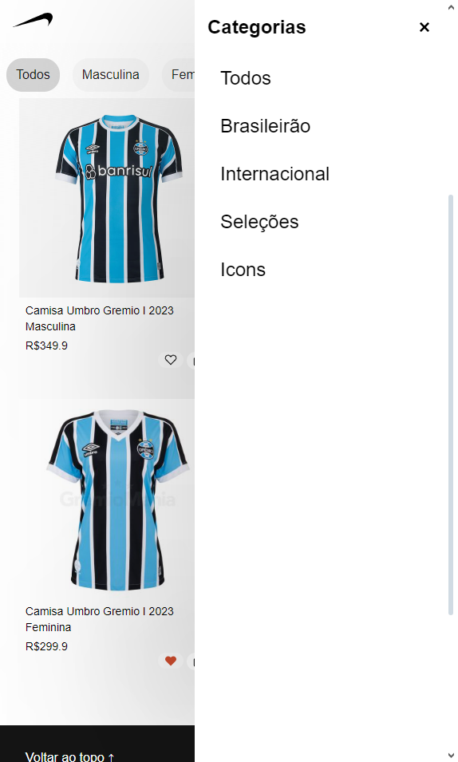
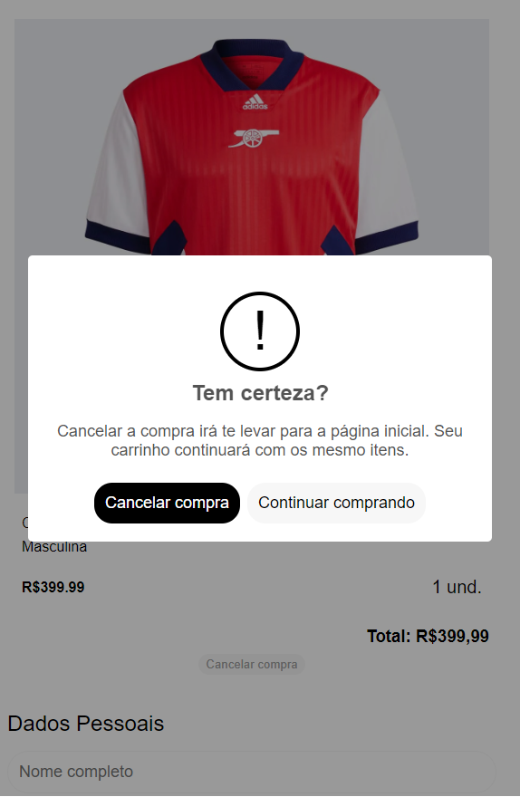
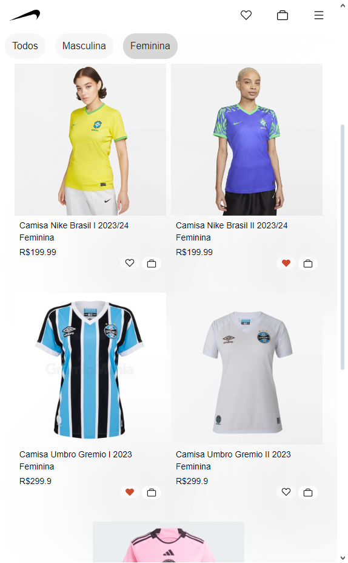
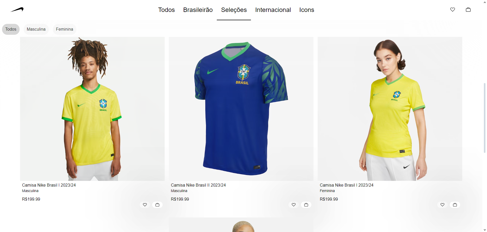
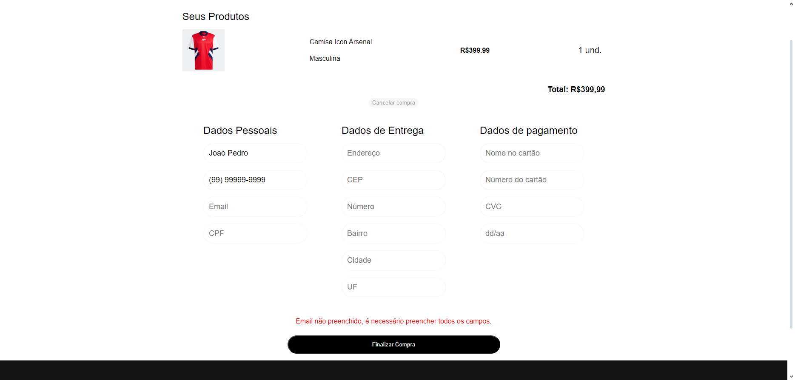
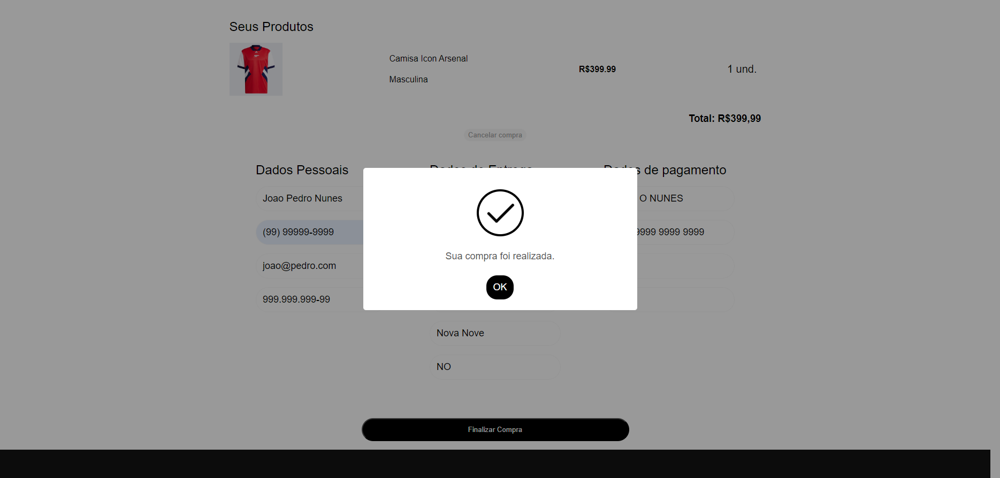

# *Ekin.com*

Ekin.com é a uma loja de camisetas de futebol online para o publico adulto, feminino e masculino. 

&nbsp;

## Índice
- <a href="#funcionalidades-do-projeto">Funcionalidades do Projeto</a>
- <a href="#layout">Layout</a>
- <a href="#demonstração">Demonstração</a>
- <a href="#tecnologias-utilizadas">Tecnologias Utilizadas</a>
- <a href="#bibliotecas-e-plugins">Bibliotecas e Plugins</a>
- <a href="#pessoas-autoras">Pessoas Autoras</a>

&nbsp;

## Funcionalidades do Projeto
- [x] Exposição do catálogo por javascript;
- [x] Carrinho com quantidades e preços resposivos;
- [x] Menu de favoritos e carrinho;
- [x] Lista de produtos no carrinho e favoritos salvo em locaStorage.
- [x] Filtro por categorias e genero
- [x] Validação de formulário de finalização de compra.
- [x] Máscara de input com jQuerry Mask

&nbsp;

## Layout

### Mobile

*Home para telas Mobile*

*'Minha Sacola' aberto em tela Mobile*

*Menu mobile de categorias*

*Alerta de Cancelamento de compra*

*Filtro de genero de peça*

### Desktop

*Home para telas de desktop*

*Menu de favoritos aberto em tamanho de tela Mobile*

*Filtro de categorias*

*Validação de Formulario*

*Alerta de Compra finalizada*

&nbsp;

## Demonstração

[Link do projeto](https://ekin-shop.vercel.app)

&nbsp;

## Tecnologias Utilizadas

1. [HTML](https://www.w3.org/html/)
2. [CSS](https://www.css3.com)
3. [JavaScript](https://www.javascript.com)

&nbsp;

## Bibliotecas e Plugins

1. [Swiper.js](https://swiperjs.com)
2. [SweetAlert2](https://sweetalert2.github.io)
3. [jQuery Mask](https://igorescobar.github.io/jQuery-Mask-Plugin/)

&nbsp;

## Pessoas Autoras

### João Pedro O. Nunes
[LinkedIn](url)

&nbsp;
