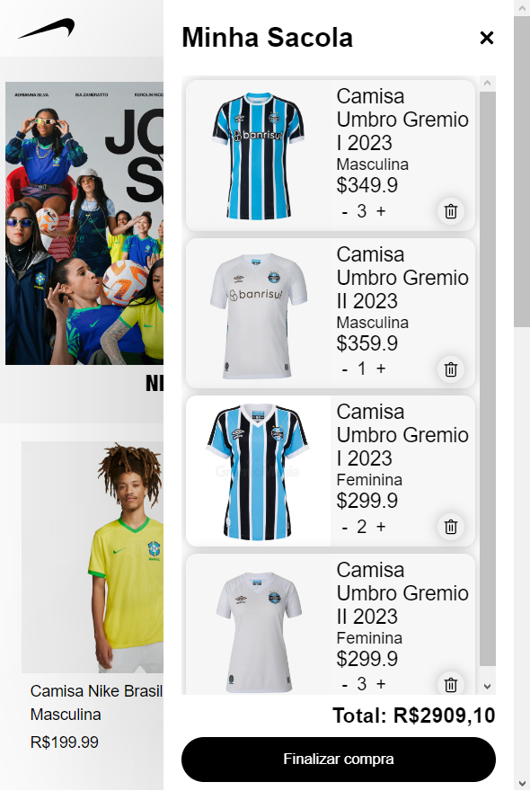
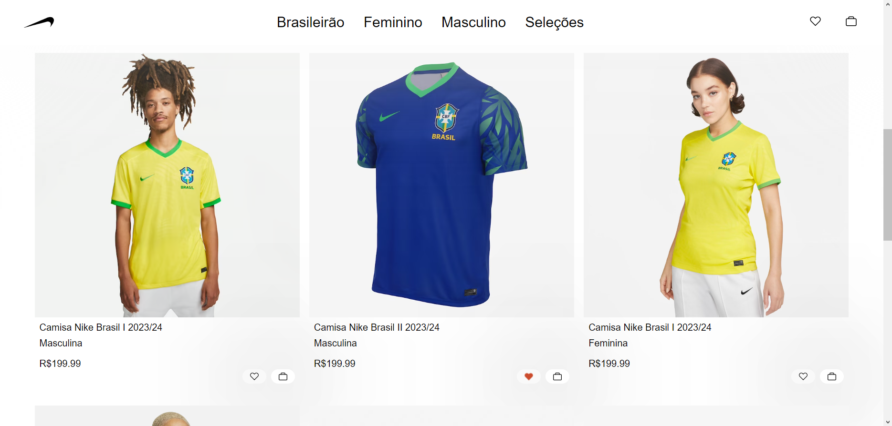
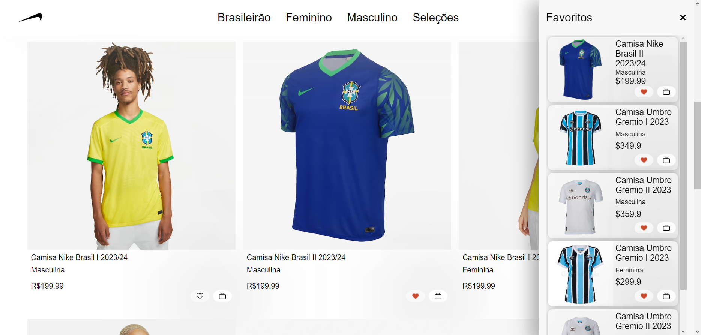

# *Ekin.com*

Ekin.com é a uma loja de camisetas de futebol online para o publico adulto, feminino e masculino. 

&nbsp;

## Índice
- <a href="#funcionalidades-do-projeto">Funcionalidades do Projeto</a>
- <a href="#layout">Layout</a>
- <a href="#demonstração">Demonstração</a>
- <a href="#tecnologias-utilizadas">Tecnologias Utilizadas</a>
- <a href="#pessoas-autoras">Pessoas Autoras</a>
- <a href="#proximos-passos">Proximos Passos</a>

&nbsp;

## Funcionalidades do Projeto
- [x] Exposição do catálogo por javascript;
- [x] Carrinho com quantidades e preços resposivos;
- [x] Menu de favoritos e carrinho;
- [x] Lista de produtos no carrinho e favoritos salvo em locaStorage.

&nbsp;

## Layout

### Mobile

### Desktop

&nbsp;

## Demonstração

[Link do projeto](https://ekin-shop.vercel.app)

&nbsp;

## Tecnologias Utilizadas

1. [HTML](https://www.w3.org/html/)
2. [CSS](https://www.css3.com)
3. [JavaScript](https://www.javascript.com)

&nbsp;

## Pessoas Autoras

### João Pedro O. Nunes
[LinkedIn](url)

&nbsp;

## Proximos Passos

- [ ] corrigir erro de valor de carrinho vazio
- [ ] sistema de tags por categorias
- [ ] formulário de finalização de compra
